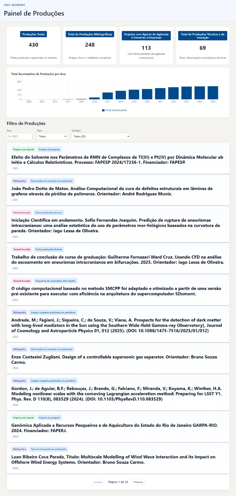

# 🚀 Painel de Produções Intelectuais LNCC SDumont

> Aplicação web moderna para visualizar e filtrar produções científicas do LNCC

## 📌 Status

- 🟢 **Projeto**: Concluído e Funcional
- 🟢 **Versão**: 1.0
- 🟢 **Licença**: LNCC Interna

## 📸 Visão Geral do Projeto



> **Dashboard completo** com estatísticas consolidadas, visualizações de tendências e filtros avançados para explorar 430+ produções intelectuais do LNCC de forma intuitiva e responsiva.

---

## ✨ Principais Features

✅ **430 Produções Intelectuais** catalogadas (2009-2026)
✅ **Dashboard Interativo** com totais por categoria
✅ **Gráfico de Tendência** visualizando crescimento
✅ **Sistema de Filtros** por Tipo, Subtipo e Ano
✅ **Interface Responsiva** com Bootstrap 5.3.3
✅ **API REST** com 5 endpoints
✅ **Containerizado** com Docker

## 🛠️ Stack Técnico

### Frontend
- **React 19.2.4** - UI Framework
- **Vite 8.0.4** - Build tool
- **Recharts 3.8.1** - Gráficos interativos
- **Axios 1.14.0** - Cliente HTTP
- **Bootstrap 5.3.3** - CSS Framework

### Backend
- **FastAPI** - Framework Python
- **SQLAlchemy** - ORM
- **PostgreSQL 15** - Banco de Dados
- **Uvicorn** - Servidor ASGI

### DevOps
- **Docker** - Containerização
- **Docker Compose** - Orquestração
- **GitHub Pages** - Deploy Frontend

## 🚀 Quick Start

### Opção 1: Com Docker (Recomendado)

```bash
# Clonar repositório
git clone https://github.com/SEU-USUARIO/Projeto-lncc.git
cd Projeto-lncc

# Iniciar containers
docker compose up -d --build

# Acessar em http://localhost:5173
```

### Opção 2: Desenvolvment Local

```bash
# Instalar dependências
npm install

# Iniciar Vite dev server
npm run dev

# Em outro terminal, iniciar backend
cd backend
pip install -r requirements.txt
uvicorn main:app --reload
```

## 📊 Dados do Projeto

| Métrica | Valor |
|---------|-------|
| Total de Produções | 430 |
| Produções Bibliográficas | 248 |
| Técnicas/Inovação | 69 |
| Projetos Financiados | 113 |
| Subtipos Únicos | 16 |
| Período Coberto | 2009-2026 |
| Endpoints API | 5 |

## 📖 Documentação

- [Documentação Completa](./DOCUMENTACAO_PROJETO.md)
- [Guia de Deploy](./GUIA_DEPLOY_GITHUB_PAGES.md)
- [Varredura Técnica](./VARREDURA_COMPLETA_FINAL.md)

## 🎯 Endpoints da API

```
GET  /api/health              - Verificar saúde do sistema
GET  /api/producoes/totais    - Totais por categoria
GET  /api/producoes/pagina    - Lista paginada
GET  /api/producoes/por-ano   - Dados por ano
GET  /api/producoes/subtipos  - Subtipos disponíveis
```

## 🔧 Comandos Úteis

```bash
# Build frontend
npm run build

# Preview build
npm run preview

# Logs dos containers
docker compose logs -f

# Parar containers
docker compose down

# Remover e resetar
docker compose down -v
docker compose up -d --build
```

## 👥 Equipe de Desenvolvimento 

Projeto idealizado e desenvolvido por:

| Integrante | Contato Profissional |
| :--- | :--- |
| **Paulo** | [](https://www.linkedin.com/in/pauloferreirarh/) [](https://github.com/phaulosantosdev) |
| **Rodrigo** | [](https://www.linkedin.com/in/rodrigo-carvalho-santos-7a16901aa/) [](https://github.com/Santos0905) |


## 📄 Licença

Licença Interna LNCC - Uso exclusivo para o Laboratório Nacional de Computação Científica.

---

**Criado para o LNCC SDumont**

Última atualização: 2026-06-27
